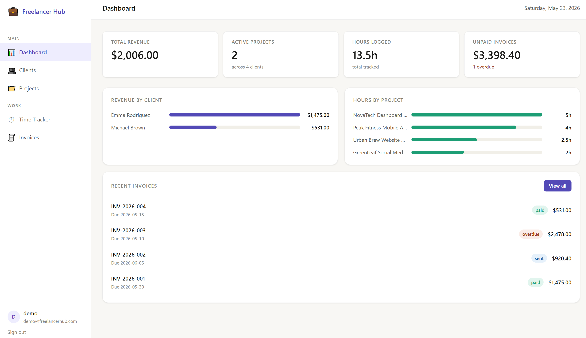
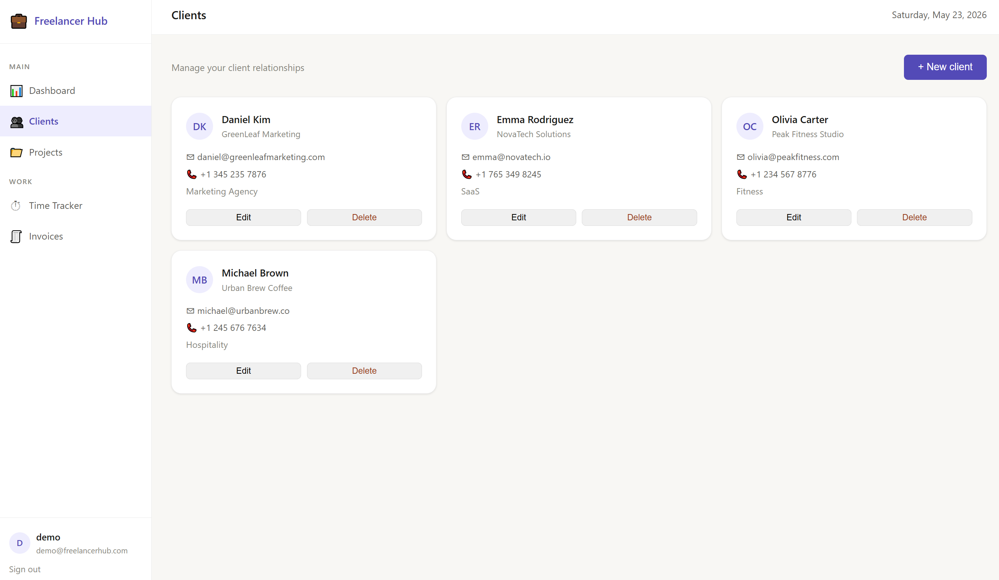
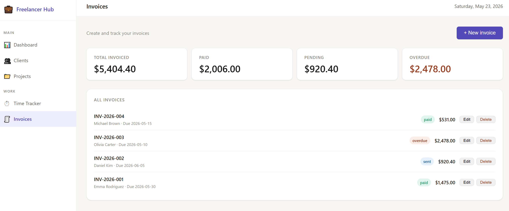
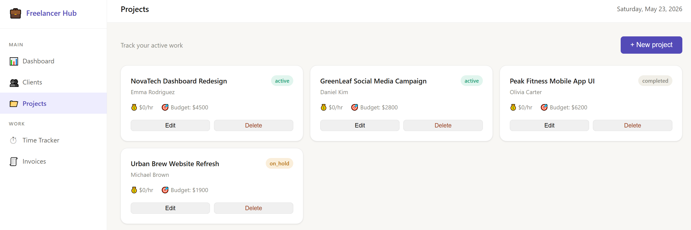
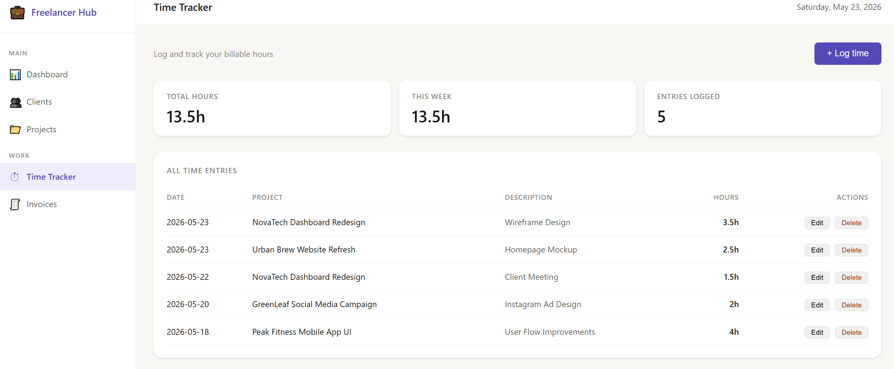
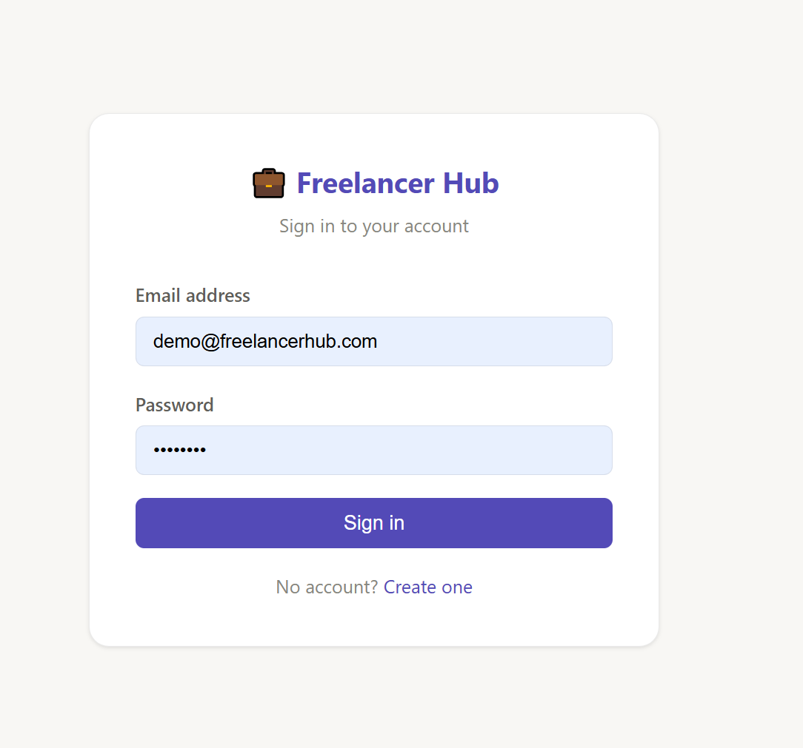

# Freelancer Business Hub

A full-stack SaaS application for freelancers to manage clients,
projects, time tracking and invoicing — with a real-time analytics dashboard.

🔗 **Live demo:** https://freelancer-hub-fw13.onrender.com

## Demo credentials

You can register a new account on the live demo or use:

Email: `demo@freelancerhub.com`
Password: `demo1234`

## Screenshots








## Features

- **Authentication** — JWT-based register/login with bcrypt password hashing
- **Client management** — Add, edit and delete clients with contact details
- **Project tracking** — Link projects to clients with hourly rates and budgets
- **Time tracking** — Log billable hours per project, grouped by date
- **Invoicing** — Create invoices with automatic tax calculation
- **Analytics dashboard** — Real-time KPIs: revenue, hours, unpaid invoices

## Tech stack

| Layer | Technology |
|-------|-----------|
| Backend | Python 3.11, FastAPI |
| Database | SQLAlchemy ORM, PostgreSQL (prod), SQLite (dev) |
| Auth | JWT tokens, bcrypt |
| Frontend | Jinja2 templates, vanilla JS |
| Deployment | Render.com, GitHub CI/CD |

## Architecture

app/

├── routers/       # HTTP endpoints (thin layer)

├── services/      # Business logic

├── models/        # SQLAlchemy database models

├── schemas/       # Pydantic validation

└── auth/          # JWT + password utilities

## Getting started locally

```bash
git clone https://github.com/YOUR_USERNAME/freelancer-hub.git
cd freelancer-hub
python -m venv venv && venv\Scripts\activate
pip install -r requirements.txt
cp .env.example .env   # add your SECRET_KEY
uvicorn app.main:app --reload
```

Visit `http://127.0.0.1:8000`

## Key engineering decisions

- **Modular architecture** — routers stay thin, business logic lives in services
- **SQLAlchemy 2.0 style** — Mapped[] typed columns for full type safety
- **Ownership security** — every query filters by user_id to prevent IDOR attacks
- **Server-side calculations** — tax and totals computed server-side, never trusted from client
- **Environment-based config** — Pydantic Settings reads from .env locally and env vars in production


## Running Tests
pip install pytest pytest-asyncio httpx pytest-cov
pytest                          # run all tests
pytest -v                       # verbose output
pytest --cov=app                # with coverage
pytest tests/test_auth.py -v    # single file

### Test structure
tests/

├── conftest.py          # shared fixtures (DB, client, auth headers)

├── test_auth.py         # register, login, JWT validation

├── test_clients.py      # client CRUD + ownership security

├── test_projects.py     # project CRUD + ownership security

├── test_invoices.py     # invoice CRUD + tax calculation + status transitions

├── test_time_entries.py # time entry CRUD + ownership security

└── test_analytics.py    # dashboard KPIs + calculation correctness

### What the tests cover
- **Authentication** — register, login, protected routes, inactive users
- **CRUD operations** — create, read, update, delete for all resources
- **Ownership security** — users cannot access each other's data
- **Business logic** — tax calculation, invoice status transitions, KPI math
- **Error handling** — 404s, 422 validation errors, 401 unauthorized